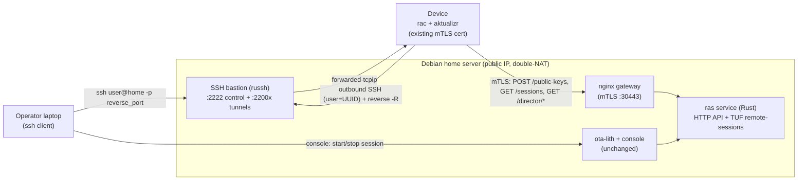

# Remote Access (RAC-compatible) — Design

Status: **implemented** — this design shipped as the `ras` service (`remote-access/ras`, reached via
the console's Remote Access page and the gateway `/ras/` route). Kept as the design record + rationale.

## 1. Goal & principles
Give this open OTA instance the same "remote access" superpower Torizon Cloud has: a secure, on-demand **reverse-SSH tunnel** to a device behind NAT, driven by the **unmodified** Torizon Remote Access Client (`rac`) that already ships in Torizon OS.

Principles: **simple, light, self-hostable.** One small extra service, no new heavy infrastructure, no changes to `ota-lith`. Reuse what we already have (the device mTLS gateway, the console, the device's existing certs).

## 2. How RAC works (recap — both halves proven)
`rac` polls a small HTTP API ("RAS") over the device's mTLS gateway cert, and — when a session is requested — opens an **outbound** SSH connection to a **bastion**, asks it to reverse-forward a port, and wires inbound connections to a local sshd. A TUF-signed `remote-sessions` role acts as a signed **allow-list** constraining what the RAS may inject. The operator then reaches the device with `ssh <user>@<bastion> -p <reverse_port>`.

Contract (validated): `POST /public-keys`, `GET /sessions`, `GET /commands`, `GET /director/root.json` + a `tough`-signed `remote-sessions.json`, plus an SSH bastion honoring `tcpip-forward`. Auth = device gateway **mTLS**; SSH username = **device UUID**.

## 3. Architecture

`ras` is **one Rust binary** that is simultaneously the HTTP API, the TUF `remote-sessions` server, and the `russh` SSH bastion. That keeps the footprint tiny.

## 4. Components

### 4.1 `ras` service (Rust; `tough` + `russh` + `axum`)
- **HTTP** (plain HTTP internally; mTLS terminated by the gateway):
  - `POST /public-keys` — store the device's SSH pubkey for its UUID (from the gateway-verified `X-Device-UUID` header). → 200.
  - `GET /sessions` — 404 if no active session for this device, else the `DeviceSession` JSON.
  - `GET /commands` — `{"values":[]}` (stub; avoids a noisy client error).
  - `GET /director/root.json` and `GET /director/remote-sessions.json` — the TUF repo (§4.3).
  - **Operator API** (from the console, not the device): `POST /admin/sessions {uuid, operator_pubkey, ttl}` to arm, `DELETE /admin/sessions/{uuid}` to stop, `GET /admin/sessions` to list active.
- **State**: SQLite (light, durable) — tables `device_keys(uuid, pubkey)` and `sessions(uuid, operator_pubkeys, reverse_port, expires_at, created_by)`. (A flat JSON file is fine for an MVP.)
- **Config**: bastion host/public name, port range, TUF signing key path, DB path, listen addr.

### 4.2 SSH bastion (embedded `russh` server)
- Fixed **host key** (generated once; its pubkey goes in the `remote-sessions` allow-list so `rac` pins it).
- **Auth**: accept pubkey auth only if `(username==UUID)` and the presented key matches a `device_keys` row for that UUID. Reject everything else. No shell, no PTY, **only** honor `tcpip-forward`.
- **Reverse forward**: on `tcpip-forward`, bind the session's assigned `reverse_port` on `0.0.0.0` and relay inbound TCP over `forwarded-tcpip` back to the device. Refuse ports outside the assigned one.
- Listens for device control connections on **:2222**; tunnel listeners live in a small range (**:22000–:2201x**).

### 4.3 `remote-sessions` TUF repo (self-signed, via `tough`)
- One ed25519 key owned by `ras` signs `root.json` + `remote-sessions.json` (byte-format proven against the `toradex/tough` fork in the spike).
- `remote-sessions.json.ssh` carries the **allow-list**: `authorized_keys` (⊇ all operator keys we hand out), `ra_server_hosts` (our bastion's public name/IP), `ra_server_ssh_pubkeys` (our bastion host key).
- `ras` **re-signs on the fly** when the allow-list changes (arming a session adds the operator key). Single-operator instance ⇒ `ras` is both RAS and TUF signer (a deliberate simplification of Torizon's two-trust-domain model; documented).

### 4.4 Gateway / mTLS integration (nginx, existing :30443)
- Add `location /ras/ { proxy_pass http://ras:PORT/; }` and `location /ras/director/ { … }`.
- The gateway already verifies device client certs for aktualizr. It extracts the device UUID from the cert (CN) into `X-Device-UUID`, and **strips any client-supplied** copy of that header. `ras` trusts it.
- `rac`'s `client.toml` sets `url = https://<gateway>/ras/` and **explicitly** `director_url = https://<gateway>/ras/director/` (must be explicit — the default `/director/` would collide with ota-lith's aktualizr director).

### 4.5 Console UI  *(UX deferred — build after P1/P2; captured here)*
- **Device detail page** (the primary entry point): a **"Remote access"** button that arms a session, then a **popup/toast showing the exact `ssh` command** to run on your PC, plus live state ("waiting for device… / connected") and a **Stop** button. Backed by the `/admin/sessions` API.
- **New left-nav section "Remote Access"** (later): configure/store your operator **public** SSH key(s) once, and list currently-running sessions with the ability to view or kill them. This is the fleet-wide view; the device-detail button is the quick per-device action.

### 4.6 Device side
- Torizon OS already ships `rac`; we only supply a `client.toml` pointing at the gateway and reusing the device's existing mTLS cert (`/var/sota/…`). Delivered via the provisioning flow or a tiny config package. Non-Torizon: ship the `rac` binary + unit.
- Recommend `session = spawned_sshd` (isolated ephemeral sshd, keys-only, no root) over `target_host`.

## 5. Session lifecycle
1. Operator clicks **Start** → console `POST /admin/sessions {uuid, operator_pubkey, ttl}`.
2. `ras` allocates a `reverse_port`, records the session, adds the operator key to `remote-sessions` and **re-signs**.
3. Device `rac` (polling `GET /sessions` every ~3 s) receives the `DeviceSession`, validates it against the signed `remote-sessions`, connects to the bastion (user=UUID), pins the host key, requests `-R reverse_port`, installs the operator key in its local sshd.
4. Console shows `ssh <user>@<public-host> -p <reverse_port>`. Operator connects; bastion relays through the tunnel.
5. **Stop** (or TTL expiry) → `ras` clears the session (and drops the operator key from the allow-list). `rac`'s next poll returns 404 → it tears the tunnel down.

## 6. Networking (the one real wrinkle: double-NAT)
The bastion needs **publicly reachable TCP ports** on your Debian server:

| Port(s) | Direction | Purpose |
|---|---|---|
| `2222` | device → bastion | `rac` control connection (SSH transport + reverse-forward request) |
| `22000–2201x` | operator → bastion | per-session reverse-tunnel listeners (N = max concurrent sessions) |
| `30443` | device → gateway | existing mTLS gateway (add `/ras/` route; no new port) |

So the router/double-NAT needs `2222` + a small tunnel-port range forwarded to the Debian server. (Everything else rides the existing setup.) A single-session MVP could forward just `2222` + one tunnel port.

## 7. Security model
- **Two layers**: `ras` (behind device mTLS) requests sessions; the TUF-signed `remote-sessions` allow-list is the signed guard on which operator keys and which bastion the device will trust. `rac` pins the bastion host key.
- **Key lifecycle**: device key persistent (registered once). Operator keys + sessions ephemeral, torn down on Stop/TTL. Bastion authorizes only registered device keys, only for reverse-forward.
- **Simplification**: single operator ⇒ `ras` holds the TUF signing key (both trust domains). Fine for self-hosted single-tenant; note it if multi-tenant ever matters.
- **Hardening**: bastion refuses shell/PTY/local-forward; gateway strips spoofed `X-Device-UUID`; operator auth is pubkey-only on the device's spawned sshd.

## 8. Decisions (locked 2026-08-06)
1. **Concurrency / port range** — start at **4** concurrent sessions → forward `2222` + `22000–22003`.
2. **Operator key handling** — **stored in the console** (a Remote Access settings area); operator provides only the **public** key, once. Console never touches private keys.
3. **State store** — **SQLite** (`rusqlite`), light + durable.
4. **Local session mode** — **`spawned_sshd`** (isolated ephemeral sshd, keys-only, no root).
5. **Bastion public hostname** — Stefano's dynamic-DNS name (TBD at deploy); must match `ra_server_hosts` in the allow-list.
6. **Where it runs** — **Debian home server** (needed for the public bastion ports); the VM was dev-only and its spike artifacts are being cleaned up.

## 9. Phased implementation plan
- **P1 — `ras` core**: HTTP API + SQLite + TUF remote-sessions signing + `russh` bastion, as one binary. Dockerized, added to compose. (Seeded from the spike code.)
- **P2 — Gateway + device**: nginx `/ras/` route + `X-Device-UUID`; a `client.toml` template + provisioning delivery; validate against a real device on the Debian server.
- **P3 — Console**: the Remote-access panel + `/admin/sessions` API + operator-key settings.
- **P4 — Hardening/polish**: TTL expiry, concurrency, bastion lock-down, docs for the router port-forwarding.

## 10. Feasibility evidence (already done)
- **Spike 1** — RAC's own end-to-end integration test passes (`tough`-signed `remote-sessions`, `/sessions`, `russh` reverse tunnel): the protocol + custom TUF role reproduce correctly with `tough`.
- **Spike 2** — the **real `rac` binary** drove a full reverse-SSH session against a minimal standalone server we wrote (`POST /public-keys`, `GET /sessions`, TUF director, `russh` bastion) over real sockets; `curl` through the tunnel returned `OK`. Confirmed: works over plain HTTP (mTLS = gateway concern), and `/commands` should be stubbed.
